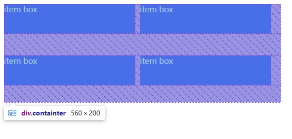
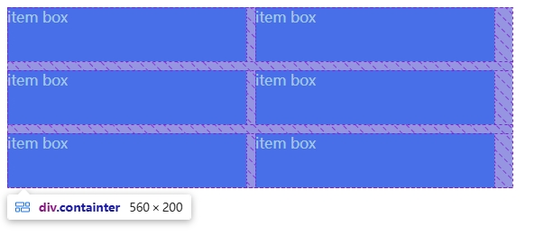
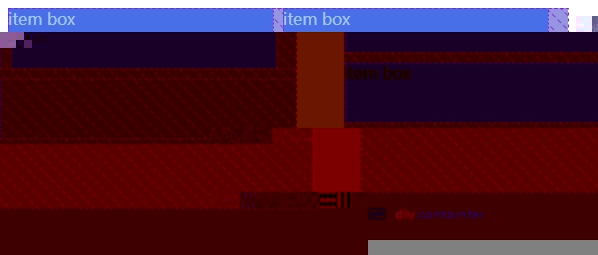
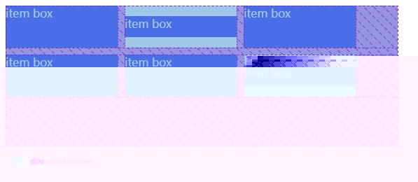

# flex 布局

父级元素，设置了弹性布局并且有固定高度和垂直滚动。对于固定宽高的子元素，需要保持子元素边距保持不变，不会因为数量导致边距变化。

```html
<div class="containter">
  <div class="item">item box</div>
  <div class="item">item box</div>
  <div class="item">item box</div>
  <!-- 任意数量子元素 -->
  </div>
</div>
```

```css
.containter {
  width: 560px;
  display: flex;
  flex-wrap: wrap;
  height: 200px;
  overflow-y: auto;
  gap: 10px 10px; /* 行列间隙固定为 10px */
  color: #fff;
}
.item {
  width: 265px; /* 固定宽高 */
  height: 60px;
  background-color: blue;
}
```

这是由于 flex 布局默认 `align-content: stretch`（多行情况下）和 `align-items: stretch`（单行情况下）





## 解决方法

> 首先确保`父元素宽度足够子元素分配间隙`，然后处理单行\列时的对齐问题。

1. 固定间隙：使用 `gap` 属性；
2. 强制分配空间：通过 `justify-content` 属性控制单行时子元素分布；
3. 拉伸剩余空间：通过 `align-content` 属性，避免多行时，间距空白被拉伸。

```css
.containter {
  width: 560px;
  display: flex;
  flex-wrap: wrap;
  height: 200px;
  overflow-y: auto;
  gap: 10px 10px; /* 行列间隙固定为 10px */
  color: #fff;

  /* 新增关键属性 */
  align-content: flex-start; /* 多行时顶部对齐，避免行间空白拉伸 */
  justify-content: flex-start; /* 子元素左对齐（按需调整）*/
  box-sizing: border-box; /* 确保padding不增加总高度 */
}
.item {
  width: 265px; /* 固定宽高 */
  height: 60px;
  background-color: blue;
}
```



## `align-content` 和 `align-items` 的区别

但是`align-content` 适用于多行，`align-items` 适用于单行。

```html
 <div class="containter">
    <div class="item">item box</div>
    <div class="item item2">item box</div>
    <div class="item">item box</div>
    <div class="item">item box</div>
    <div class="item ">item box</div>
    <div class="item item2">item box</div>
  </div>
```

```css
.containter {
  width: 560px;
  display: flex;
  flex-wrap: wrap;
  height: 200px;
  overflow-y: auto;
  gap: 10px 10px; /* 行列间隙固定为 10px */
  color: #fff;

  /* 新增关键属性 */
  align-content: flex-start; /* 多行时顶部对齐，避免行间空白拉伸 */
  justify-content: flex-start; /* 子元素左对齐（按需调整）*/
  box-sizing: border-box; /* 确保padding不增加总高度 */

  /* 新增属性 */
  align-items: center; /* 所在行交叉轴上居中对齐 */
}
.item {
  width: 265px; /* 固定宽高 */
  height: 60px;
  background-color: blue;
}
.item2 {
  height: 30px;
}
```



## 总结

`align-content` 和 `align-items` 都可以使元素对齐。但是`align-content` 适用于多行，`align-items` 适用于单行。

要使 `align-content` 对单行生效，需要设置 `flex-wrap: wrap`，这样才能使元素多行，即使子元素表面显示单行，但 `align-content` 依然生效。

设置 `flex-wrap:wrap;` 实现多行：

1. 设置 `align-item: center`，使子项在自己所在行的交叉轴上居中对齐
2. 设置 `align-content:center`，使子项作为一个整体在交叉轴上对齐
