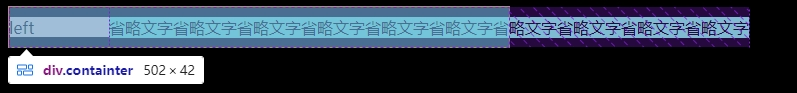
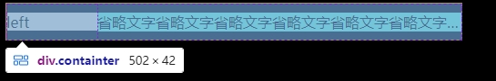

## 1. flex弹性布局 子元素高度不撑满父元素高度问题

使用了flex弹性布局，正常情况弹性布局左右子项默认撑满父级高度；默认横向排列方向，我们一般都会设置一个 `align-items: center;` 让子元素对齐，结果对齐是对齐了。
但出现了另一个问题：左边子元素高度消失，没办法随着右边子元素数据高度一致

问题分析：排查下是 `align-items` 的锅

解决方案：如果有这种需求，就要注意弹性布局的细节了，这样子不能在父元素进行对齐，我们可以在子元素内再进行弹性布局设计

[解决参考](https://juejin.cn/post/7222897190711607333)

## flex布局下文本溢出省略号失效

```html
<div class="containter">
  <div class="left">left</div>
    <div class="right">
      <div class="content">
        省略文字省略文字省略文字省略文字省略文字省略文字省略文字省略文字省略文字省略文字
    </div>
  </div>
</div>
```

```css
.containter {
  width: 500;
  height: 40px;
  display: flex;
  align-items: center;
  border: 1px solid black;
  .left {
    width: 100px;
    height: 20px;
    flex: none;
    background-color: blanchedalmond;
  }
  .right {
    flex: 1;
    background-color: aquamarine;
    .content {
      overflow: hidden;
      text-overflow: ellipsis;
      white-space: nowrap;
    }
  }
}
```



### 解决方法

1. 给类名为 right 元素设置 `overflow: hidden`
2. 给类名为 right 元素设置 `min-width: 0`

```diff
.containter {
  width: 500;
  height: 40px;
  display: flex;
  align-items: center;
  border: 1px solid black;
  .left {
    width: 100px;
    height: 20px;
    flex: none;
    background-color: blanchedalmond;
  }
  .right {
    flex: 1;
+   overflow: hidden;
+   min-width: 0;
    background-color: aquamarine;
    .content {
      overflow: hidden;
      text-overflow: ellipsis;
      white-space: nowrap;
    }
  }
}
```


