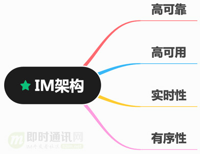

## 概念

`IM系统` 是即时通讯系统的简称（Instant Messaging）

### 应用场景

应用场景广泛：聊天、直播、在线客服、物联网等所有需要实时互动、高实时性的场景，都需要应用IM技术。

1. 典型应用场景：微信、qq、钉钉等主流IM应用
2. 微博、知乎等社区应用：利用IM技术实现了用户私信等点对点聊天
3. 抖音、快手等直播/短视频应用：它们利用IM技术实现了与主播的实时互动
4. 智能家居物联网应用：利用IM技术实现实时控制、远程监控等
5. 滴滴、Uber等共享家通类应用：利用IM技术实现位置共享
6. 在线教育类应用：利用IM技术实现在线白板

### 常见术语

1. 用户：系统的使用者
2. 消息：是指用户之间的沟通内容（通常在IM系统中，消息会有以下几类：文本消息、表情消息、图片消息、视频消息、文件消息等等）
3. 会话：通常指两个用户之间因聊天而建立起的关联。 3）群：通常指多个用户之间因聊天而建立起的关联
4. 终端：指用户使用IM系统的机器（通常有Android端、iOS端、Web端等等）
5. 未读数：指用户还没读的消息数量
6. 用户状态：指用户当前是在线、离线还是挂起等状态
7. 关系链：是指用户与用户之间的关系，通常有单向的好友关系、双向的好友关系、关注关系等等
8. 单聊：一对一聊天
9. 群聊：多人聊天
10. 客服：在电商领域，通常需要对用户提供售前咨询、售后咨询等服务
11. 信箱：收发消息的Timeline、收发消息的队列

### 基础架构

1. 客户端：作为与服务端进行消息收发通信的终端
2. 网关层：也叫接入层，为客户端收发消息提供入口
3. 服务层：负责IM系统各功能的核心业务逻辑实现，比如聊天服务、离线消息服务、红包服务、直播服务等
4. 存储层：负责IM系统相关数据的持久化存储，包括消息内容、账号信息、社交关系链等

### 技术指标

1. 高可靠：确保不丢消息
2. 高可用：任意机房或者服务器挂掉，不影响服务
3. 实时性：不管用户在哪里，在线用户消息在1秒内达到
4. 有序性：确保用户消息的有序性，不会出现发送和接受的乱序

## 企业级系统核心架构

## 参考

1. [亿级IM聊天系统架构设计与重难点分析](https://juejin.cn/post/7352797634556428303)
2. [一套亿级用户的IM架构技术干货](http://www.52im.net/thread-3393-1-1.html)
