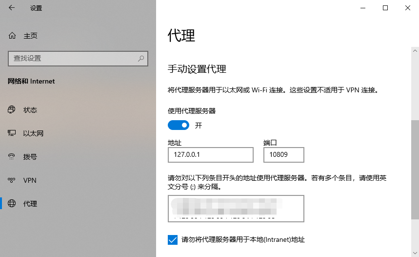

> 由于众所周知的原因，访问 `github` 需要科学上网

但是在执行 `git pull`、`git push` 或 `git clone` 时，会遇到一下报错

```shell
Failed to connect to github.com port 443 : Timed out
```

## 问题

打开了梯子，能访问 github 网页，也能 ping github，但是 git 操作时却失败。
> 分析：git 所设端口与系统代理不一致，需重新设置

## 设置 proxy

获取电脑的代理：打开电脑的 `设置`，选择 `网络和Internet`，选择 `代理`



```shell
# 注意修改成自己系统代理的 IP 地址和端口号
git config --global http.proxy http://127.0.0.1:10809
git config --global https.proxy http://127.0.0.1:10809
```

## 清除 proxy

```shell
git config --global --unset http.proxy
git config --global --unset https.proxy
```

## 参考

1. [github](https://github.com/orgs/community/discussions/49456)
