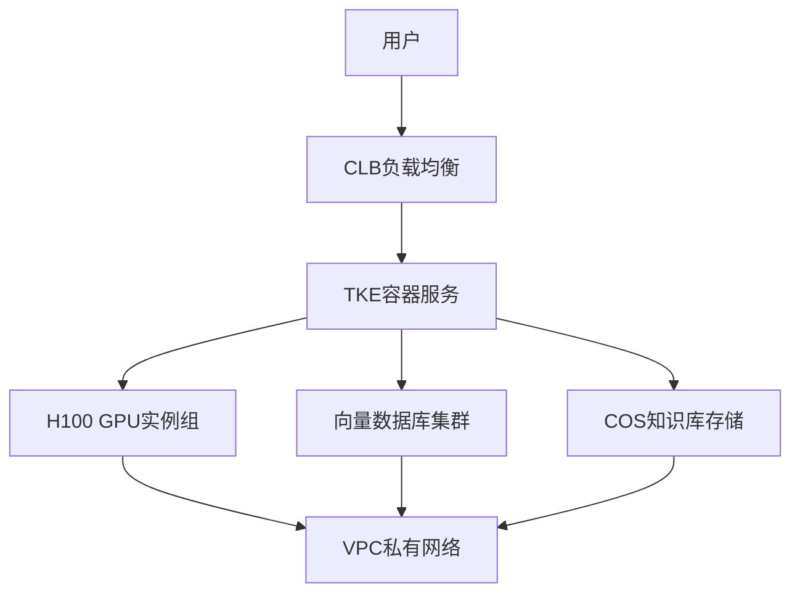
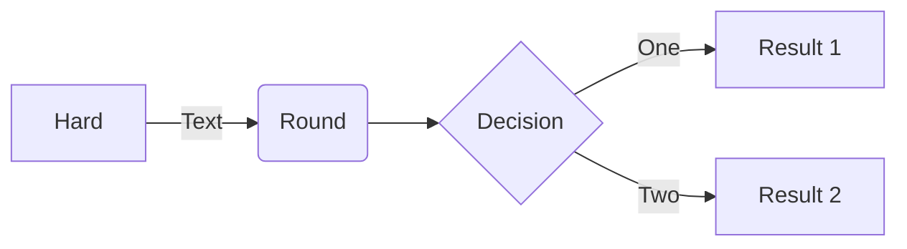
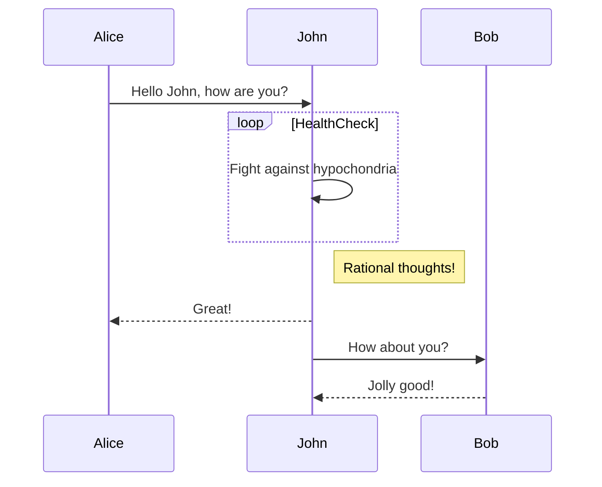
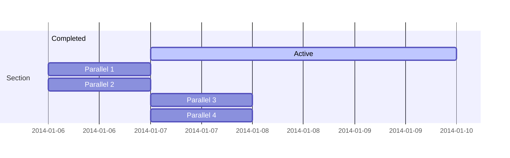
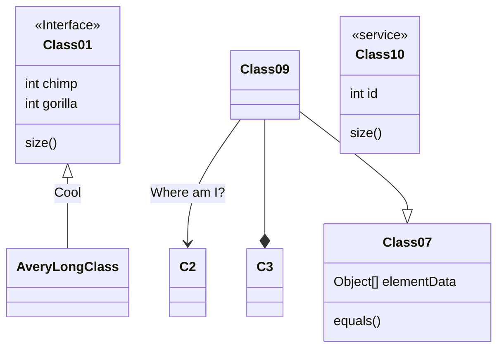
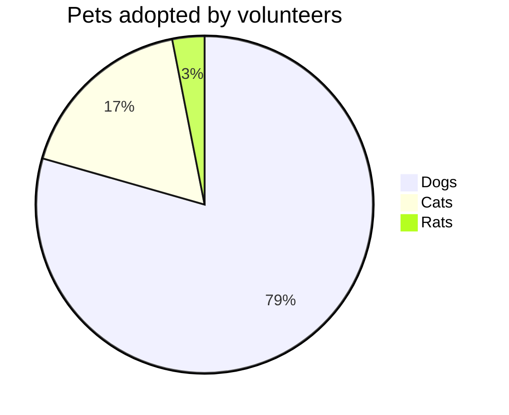
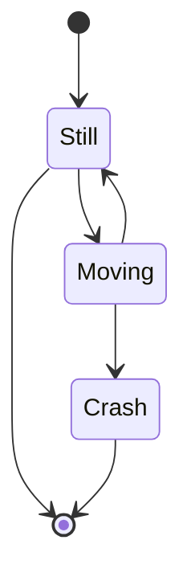
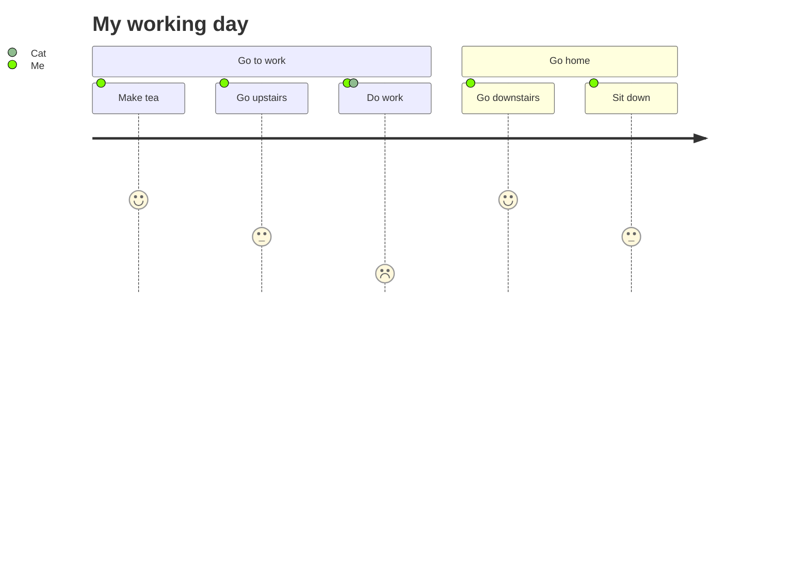
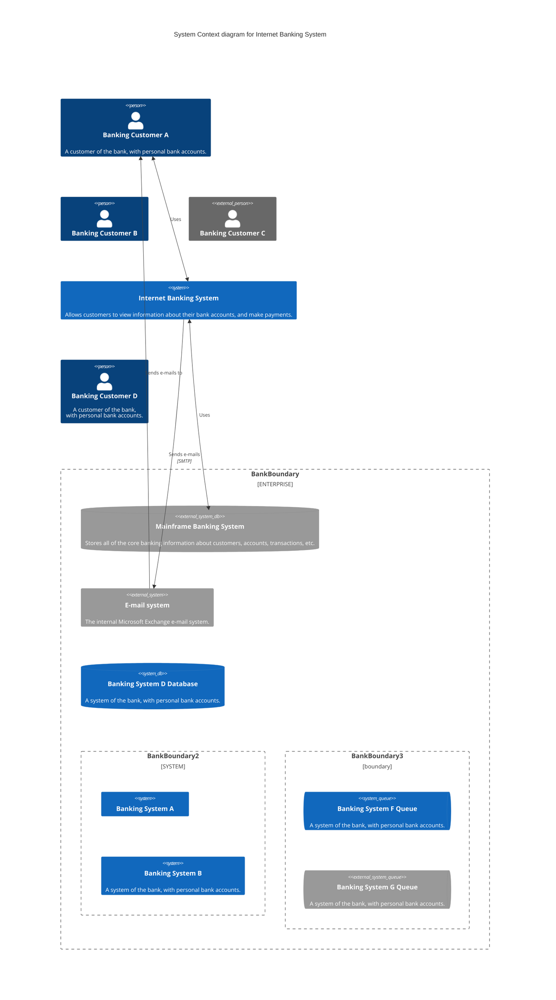

## 示例

### 流程图

### 时序图

### 甘特图

### 类图

### 饼图

### 状态图

### 用户体验旅程图

### C4 图

## 参考

1. [mermaid 中文网](https://mermaid.nodejs.cn/intro/)
2. [mermaid-live](https://mermaid-live.nodejs.cn)
