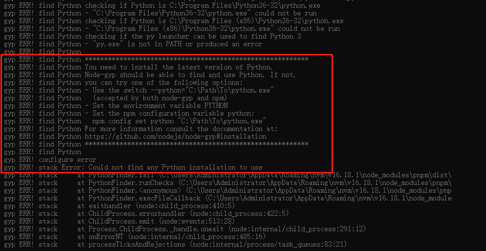

在项目中执行 `pnpm install` 命令时，会遇到以下报错



> 这是因为有些模块编译需要用到 `node-gyp` 去构建一些模块, `GYP` 是基于 `Python2`  开发的, 所以需要 `Python`, 而且不支持 `Python3`

## 解决

### 1.全局安装 `node-gyp`

```shell
npm install -g node-gyp
```

### 2.安装 `Python2`

在 [Python 官网](https://www.python.org) 找到 [Python2.7.18 版本](https://www.python.org/downloads/release/python-2718)

win 推荐安装 `Windows x86-64 MSI installer` 版本，下载好安装包后，直接安装一路默认操作

#### 配置环境变量

提示：安装默认设置下，这里 Python 安装在 C 盘，设置环境变量以实际安装路径

```shell
# 安装路径
C:\Python27
# 安装路径下的 Scripts 路径
C:\Python27\Scripts
```


设置好环境变量后，在 cmd 命令行窗口输入 `python -v`, 可以看到对应 python 版本信息, 至此 python 安装和环境变量设置完成


## 安装依赖

项目重新执行 `pnpm install`, 项目依赖成功安装

## 参考

1. [node-gyp](https://github.com/nodejs/node-gyp#on-windows)
2. [stackoverflow](https://stackoverflow.com/questions/34372618/npm-cant-find-python-executable-python-you-can-set-the-python-env-variabl)
