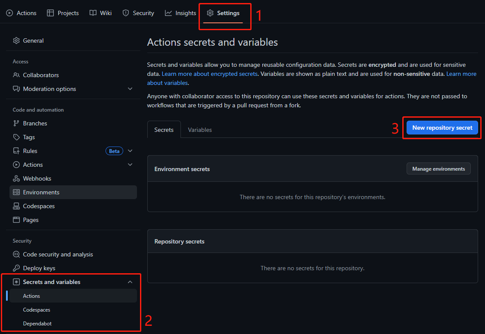

在 GitHub Actions 的仓库中自动化、自定义和执行软件开发工作流程。 您可以发现、创建和共享操作以执行您喜欢的任何作业（包括 CI/CD），并将操作合并到完全自定义的工作流程中。

## 基础概念

1. `workflow` (工作流程): 持续集成一次运行的过程，就是一个 `workflow`
2. `job` (任务): 一个 `workflow` 由一个或多个 `jobs` 构成，含义是一次持续集成的运行，可以完成多个任务
3. `step` (步骤): 每个 `job` 由多个 `step` 构成，一步步完成
4. `action` (动作): 每个 `step` 可以依次执行一个或多个命令 `action`


## workflow 文件

GitHub Actions 的配置文件叫做 workflow 文件，存放在代码仓库根目录的 `.github/workflows` 目录

workflow 文件采用[yaml 格式](https://learnxinyminutes.com/docs/yaml/)，查看[工作流程语法](https://docs.github.com/zh/actions/using-workflows/workflow-syntax-for-github-actions)

## 创建一个 workflow 流程

在 `.github/workflows` 目录下创建一个 `ci.yml` 文件，这是一个把 vue3 + ts 项目打包部署至 github pages 的构建流程
当工程有提交代码至 `main` 分支时，这个 `workflow` 会执行，并通过 `JamesIves/github-pages-deploy-action@v4` 部署到 github pages

```yml
name: GitHub Actions Demo # 为这个 actions 命名，忽略此字段，则默认会设置为 workflow 文件名
on: # 此CI/CD触发时的事件
  push: # 在代码提交时自动触发，同样也可以指定在 打 tag、release、pull_request、定时、某个文件变动、仓库被start 时触发
    branches:
      - main # 代码提交 main 分支会执行

permissions:
  contents: write

jobs: # CI 要执行的任务
  build-and-deploy: # 要执行任务的名字这个名字可以随便改 job1、job2... 都行
    runs-on: ubuntu-latest # 当前任务运行环境 目前支持 Windows、Ubuntu、MacOs
    steps: # 在 ubuntu-latest 下运行以下步骤
      # 下载源码
      # uses 的作用是使用另一个仓库的代码，如下
      # uses: actions/checkout@master 使用 actions 用户的 checkout 仓库的 v3
      - uses: actions/checkout@v3 # 第一步，下载代码仓库

      # 安装 pnpm
      - name: Install pnpm # 步骤的名字，可以不写
        uses: pnpm/action-setup@v2.2.4
        with: # 给使用的另一个仓库代码传递参数
          version: 7

      # 设置 node 版本
      - name: Set node version to 18
        uses: actions/setup-node@v3
        with:
          node-version: 18
          cache: "pnpm"

      # 打包构建
      - name: Install and Build
        # run 为在系统在执行该命令
        run: |
          pnpm install
          pnpm run build

      # 命名这个任务为发布 Deploy
      - name: Deploy 🚀
        uses: JamesIves/github-pages-deploy-action@v4
        with:
          folder: dist # The folder the action should deploy.
          clean: true
```

## GitHub Secrets 变量配置

> 在 CI 的过程中可能会使用到敏感信息: 账户，密码等, 而 CI 文件在项目中是开发者可见的，存在巨大风险。
>
为了能在 CI 中使用这些信息需要配置一下 GitHub Secrets

1. 进入仓库 `Settings tab` 页，选择 `Secrets and variables` 选项 `Actions` 即可对 `Secrets` 信息进行管理
  

2. 点击 `New repository secret` 按钮新增 `Secrets`
   

## 部署至 github pages

在 github 项目中，找到 `Settings` 模块，点击 `Pages` 选择，进行 GitHub Pages 相关设置，默认使用 `gh-pages` 分支作为 GitHub Pages 站点构建分支

## 参考

1. [GitHub Actions 文档](https://docs.github.com/zh/actions)
2. [GitHub Pages 文档](https://docs.github.com/zh/pages/quickstart)
3. [GitHub Actions 入门教程 - 阮一峰](https://www.ruanyifeng.com/blog/2019/09/getting-started-with-github-actions.html)
4. [github-pages-deploy-action](https://github.com/JamesIves/github-pages-deploy-action)
5. [学会用 Github Action 入门](https://juejin.cn/post/7113562222852309023)
6. [快速编写一个自己的 Github Action](https://juejin.cn/post/7191357386139893817)
7. [使用 Github Actions 实现 CI/CD](https://juejin.cn/post/7044157768445460487)
