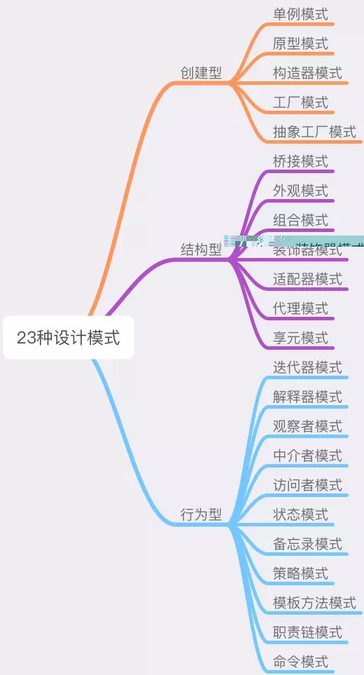

> 每一个模式描述了一个在我们周围不断重复发生的问题，以及该问题的解决方案的核心。这样，你就能一次又一次地使用该方案而不必做重复劳动。 —— Christopher Alexander

## 设计原则

面向对象编程和面向对象设计的五个基本原则

1. 单一功能原则 (Single Responsibility Principle)
2. 开放封闭原则 (Opened Closed Principle)
3. 里式替换原则 (Liskov Substitution Principle)
4. 接口隔离原则 (Interface Segregation Principle)
5. 依赖反转原则 (Dependency Inversion Principle)

## 设计模式的核心思想——封装变化

设计模式出现的背景，是软件设计的复杂度日益飙升。软件设计越来越复杂的“罪魁祸首”，就是`变化`。

在实际开发中，将业务变动造成的影响最小化，将变与不变分离，确保变化的部分灵活、不变的部分稳定。

## 设计模式

设计模式分为3种类型：创建型、结构性和行为型

- 创建型：封装了创建对象过程中的变化
- 结构型：封装的是对象之间组合方式的变化，目的在于灵活地表达对象间的配合与依赖关系
- 行为型：将千变万化的行为进行抽离，确保我们能够更安全、更方便地对行为进行更改

`封装变化`，封装的是软件中不稳定的因素，是一种防患于未然的行为，提前抽离了变化，为后续的拓展提供了无限的可能性。
